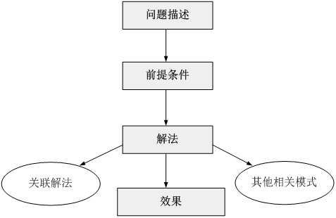
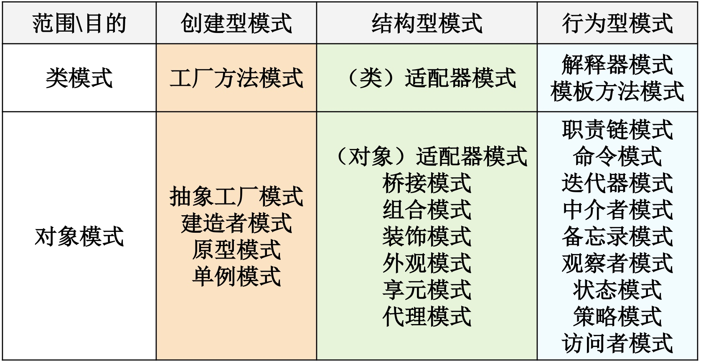

# 一、设计模式概述
## 1.1、设计模式的诞生和发展
与很多其他软件工程技术一样，设计模式起源于**建筑领域**

### 1.1.1、模式的诞生与定义

模式是如何诞生的？让我们先来认识一个人——`Christopher Alexander`（克里斯托弗.亚历山大），哈佛大学建筑学博士、美国加州大学伯克利分校建筑学教授、加州大学伯克利分校环境结构研究所所长、美国艺术和科学院院士……头衔真多，不过他还有一个“昵称”——模式之父(`The father of patterns`)。`Christopher Alexander`博士及其研究团队用了约20年的时间，对住宅和周边环境进行了大量的调查研究和资料收集工作，发现人们对舒适住宅和城市环境存在一些共同的认同规律，`Christopher Alexander`在著作A Pattern Language: Towns, Buildings, Construction中把这些认同规律归纳为253个模式，对每一个模式(Pattern)都从Context（前提条件）、Theme或Problem（目标问题）、 Solution（解决方案）三个方面进行了描述，并给出了从用户需求分析到建筑环境结构设计直至经典实例的过程模型。

在对建筑模式进行了系统的分析和整理之后，`Alexander`给出了模式的经典定义：**每个模式都描述了一个在我们的环境中不断出现的问题，然后描述了该问题的解决方案的核心，通过这种方式人们可以无数次地重用那些已有的解决方法，无须再重复相同的工作。**这个定义可以简单的用一句话表示：
> 模式是在特定环境下人们解决某类重复出现问题的一套成功或有效的解决方案。【A pattern is a successful or efficient solution to a recurring  problem within a context】

### 1.1.2、软件模式概述
1990年，软件工程界开始关注`Christopher Alexander`等在这一住宅、公共建筑与城市规划领域的重大突破。最早将模式的思想引入软件工程方法学的是1991-1992年以“四人组(Gang of Four，简称**GoF**，分别是`Erich Gamma`, `Richard Helm`, `Ralph Johnson`和`John Vlissides`)”自称的四位著名软件工程学者，他们在1994年归纳发表了**23**种在软件开发中使用频率较高的设计模式，旨在用模式来统一沟通面向对象方法在分析、设计和实现间的鸿沟。

GoF将模式的概念引入软件工程领域，这标志着软件模式的诞生。软件模式(Software Patterns)是将模式的一般概念应用于软件开发领域，即软件开发的总体指导思路或参照样板。**软件模式并非仅限于设计模式，还包括架构模式、分析模式和过程模式等**，实际上，在软件开发生命周期的每一个阶段都存在着一些被认同的模式。

软件模式是在软件开发中某些可重现问题的一些有效解决方法，软件模式的基础结构主要由四部分构成，包括**问题描述【待解决的问题是什么】、前提条件【在何种环境或约束条件下使用】、解法【如何解决】和效果【有哪些优缺点】**

软件模式与具体的应用领域无关，也就是说无论你从事的是移动应用开发、桌面应用开发、Web应用开发还是嵌入式软件的开发，都可以使用软件模式。

在软件模式中，设计模式是研究最为深入的分支，**设计模式用于在特定的条件下为一些重复出现的软件设计问题提供合理的、有效的解决方案，它融合了众多专家的设计经验，已经在成千上万的软件中得以应用**。 1995年， GoF将收集和整理好的23种设计模式汇编成Design Patterns: Elements of Reusable Object-Oriented Software【《设计模式：可复用面向对象软件的基础》】一书，该书的出版也标志着设计模式正式成为面向对象(Object Oriented)软件工程的一个重要研究分支。

## 1.2、设计模式的定义与分类

### 1.2.1、设计模式的定义

> 设计模式(Design Pattern)是一套被反复使用、多数人知晓的、经过分类编目的、代码设计经验的总结，使用设计模式是为了可重用代码、让代码更容易被他人理解并且保证代码可靠性。

狭义的设计模式是指GoF在《设计模式：可复用面向对象软件的基础》一书中所介绍的23种经典设计模式，不过设计模式并不仅仅只有这23种，随着软件开发技术的发展，越来越多的新模式不断诞生并得以应用。

### 1.2.2、设计模式的基本要素

设计模式一般包含**模式名称、问题、解决方案、效果**等组成要素

**模式名称(Pattern Name)**通过一两个词来描述模式的问题、解决方案和效果，以便更好地理解模式并方便开发人员之间的交流，绝大多数模式都是根据其功能或模式结构来命名的

**问题(Problem)**描述了应该在何时使用模式，它包含了设计中存在的问题以及问题存在的原因；

**解决方案(Solution)**描述了一个设计模式的组成成分，以及这些组成成分之间的相互关系，各自的职责和协作方式，通常解决方案通过UML类图和核心代码来进行描述；

**效果(Consequences)**描述了模式的优缺点以及在使用模式时应权衡的问题。

### 1.2.3、设计模式的分类

虽然GoF设计模式只有23个，但是它们各具特色，每个模式都为某一个可重复的设计问题提供了一套解决方案。根据**它们的用途**，设计模式可分为**创建型(Creational)**，**结构型(Structural)**和**行为型(Behavioral)**三种。

其中创建型模式主要用于描述如何创建对象；

结构型模式主要用于描述如何实现类或对象的组合；

行为型模式主要用于描述类或对象怎样交互以及怎样分配职责；

在GoF 23种设计模式中包含5种创建型设计模式、7种结构型设计模式和11种行为型设计模式。

此外，根据某个模式主要是用于**处理类之间的关系还是对象之间的关系**，设计模式还可以分为类模式和对象模式。

## 1.3 GoF 设计模式简介

**创建型模式：**

* 抽象工厂模式(Abstract Factory) ★★★★★
* 建造者模式(Builder) ★★☆☆☆
* 工厂方法模式(Factory Method) ★★★★★
* 原型模式(Prototype) ★★★☆☆
* 单例模式(Singleton) ★★★★☆ 

**结构型模式：**

* 适配器模式(Adapter) ★★★★☆
* 桥接模式(Bridge) ★★★☆☆
* 组合模式(Composite) ★★★★☆
* 装饰模式(Decorator) ★★★☆☆
* 外观模式(Facade) ★★★★★
* 享元模式(Flyweight) ★☆☆☆☆
* 代理模式(Proxy) ★★★★☆

**行为型模式：**
* 职责链模式(Chain of Responsibility) ★★☆☆☆
* 命令模式(Command) ★★★★☆
* 解释器模式(Interpreter) ★☆☆☆☆
* 迭代器模式(Iterator) ★★★★★
* 中介者模式(Mediator) ★★☆☆☆
* 备忘录模式(Memento) ★★☆☆☆
* 观察者模式(Observer) ★★★★★
* 状态模式(State) ★★★☆☆
* 策略模式(Strategy) ★★★★☆
* 模板方法模式(Template Method) ★★★☆☆
* 访问者模式(Visitor) ★☆☆☆☆

## 1.4、设计模式的优点

* **融合了众多专家的经验**，并以一种标准的形式供广大开发人员所用
* **提供了一套通用的设计词汇和一种通用的语言**，以方便开发人员之间进行沟通和交流，使得设计方案更加通俗易懂
* 让人们可以更加**简单方便地复用成功的设计和体系结构**
* 使得**设计方案更加灵活**，且易于修改
* 将**提高**软件系统的**开发效率和软件质量**，在一定程度上**节约设计成本**
* **有助于**初学者更**深入地理解面向对象思想**，方便阅读和学习现有类库与其他系统中的源代码，还可以提高软件的设计水平和代码质量

