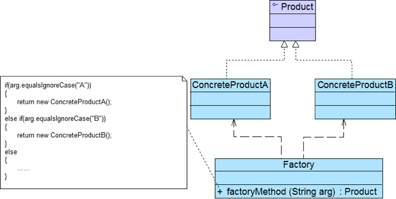
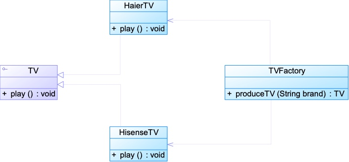

# 三、简单工厂模式
## 3.1、具体场景分析

```
Sunny软件公司欲基于Java语言开发一套图表库，该图表库可以为应用系统提供各种不同外观的图表，例如柱状图、饼状图、折线图等。Sunny软件公司图表库设计人员希望为应用系统开发人员提供一套灵活易用的图表库，而且可以较为方便地对图表库进行扩展，以便能够在将来增加一些新类型的图表。
```

Sunny软件公司图表库设计人员提出了一个初始设计方案，将所有图表的实现代码封装在一个Chart类中，其框架代码如下所示：

```java
class Chart {
	private String type; //图表类型
	
	public Chart(Object[][] data, String type) {
		this.type = type;
		if (type.equalsIgnoreCase("histogram")) {
			//初始化柱状图
		}
		else if (type.equalsIgnoreCase("pie")) {
			//初始化饼状图
		}
		else if (type.equalsIgnoreCase("line")) {
			//初始化折线图
		}
	}
 
	public void display() {
		if (this.type.equalsIgnoreCase("histogram")) {
			//显示柱状图
		}
		else if (this.type.equalsIgnoreCase("pie")) {
			//显示饼状图
		}
		else if (this.type.equalsIgnoreCase("line")) {
			//显示折线图
		}	
	}
}
```

客户端代码通过调用Chart类的构造函数来创建图表对象，根据参数type的不同可以得到不同类型的图表，然后再调用display()方法来显示相应的图表。

不难看出，Chart类是一个“巨大的”类，在该类的设计中存在如下几个问题：

(1) **在Chart类中包含很多“if…else…”代码块**，整个类的代码相当冗长，代码越长，阅读难度、维护难度和测试难度也越大；而且大量条件语句的存在还将影响系统的性能，程序在执行过程中需要做大量的条件判断。

(2) **Chart类的职责过重**，它负责初始化和显示所有的图表对象，将各种图表对象的初始化代码和显示代码集中在一个类中实现，违反了“单一职责原则”，不利于类的重用和维护；而且将大量的对象初始化代码都写在构造函数中将导致构造函数非常庞大，对象在创建时需要进行条件判断，降低了对象创建的效率。

(3) 当需要增加新类型的图表时，**必须修改Chart类的源代码，违反了“开闭原则”**。

(4) 客户端**只能通过new关键字来直接创建Chart对象，Chart类与客户端类耦合度较高**，对象的创建和使用无法分离。

(5) 客户端在创建Chart对象之前可能还**需要进行大量初始化设置**，例如设置柱状图的颜色、高度等，如果在Chart类的构造函数中没有提供一个默认设置，那就只能由客户端来完成初始设置，这些代码在每次创建Chart对象时都会出现，导致代码的重复。

面对一个如此巨大、职责如此重，且与客户端代码耦合度非常高的类，我们应该怎么办？简单工厂模式将在一定程度上解决上述问题。

## 3.2、简单工厂模式概述

简单工厂模式并不属于GoF 23个经典设计模式，但通常将它作为学习其他工厂模式的基础，它的设计思想很简单，其基本流程如下：

首先将需要创建的各种不同对象（例如各种不同的Chart对象）的相关代码封装到不同的类中，这些类称为**具体产品类**，而将它们公共的代码进行抽象和提取后封装在一个**抽象产品类**中，每一个具体产品类都是抽象产品类的子类；然后提供一个**工厂类**用于创建各种产品，在工厂类中提供一个创建产品的工厂方法，该方法可以根据所传入的参数不同创建不同的具体产品对象；客户端只需调用工厂类的工厂方法并传入相应的参数即可得到一个产品对象。

简单工厂模式定义如下：

> 简单工厂模式(Simple Factory Pattern)：定义一个工厂类，它可以根据参数的不同返回不同类的实例，被创建的实例通常都具有共同的父类。因为在简单工厂模式中用于创建实例的方法是静态(static)方法，因此简单工厂模式又被称为静态工厂方法(Static Factory Method)模式，它属于类创建型模式。

简单工厂模式的要点在于：**当你需要什么，只需要传入一个正确的参数，就可以获取你所需要的对象，而无须知道其创建细节**。简单工厂模式结构比较简单，其核心是工厂类的设计，其结构如图1所示：



## 3.3、模式结构

在简单工厂模式结构图中包含如下几个角色：

* Factory（工厂角色）：工厂角色即工厂类，它是简单工厂模式的核心，负责实现创建所有产品实例的内部逻辑；工厂类可以被外界直接调用，创建所需的产品对象；在工厂类中提供了静态的工厂方法factoryMethod()，它的返回类型为抽象产品类型Product。

* Product（抽象产品角色）：它是工厂类所创建的所有对象的父类，封装了各种产品对象的公有方法，它的引入将提高系统的灵活性，使得在工厂类中只需定义一个通用的工厂方法，因为所有创建的具体产品对象都是其子类对象。

* ConcreteProduct（具体产品角色）：它是简单工厂模式的创建目标，所有被创建的对象都充当这个角色的某个具体类的实例。每一个具体产品角色都继承了抽象产品角色，需要实现在抽象产品中声明的抽象方法。

## 3.4、模式分析

* **将对象的创建和对象本身业务处理分离可以降低系统的耦合度**，使得两者修改起来都相对容易

* 在调用工厂类的工厂方法时，由于工厂方法是**静态方法**，使用起来很方便，可通过工厂类类名直接调用，**只需要传入一个简单的参数**即可，无须知道对象的创建细节

* 可以将参数保存在XML等格式的配置文件中，修改时无须修改任何Java源代码

* 问题：**工厂类的职责相对过重**，增加新的产品需要修改工厂类的判断逻辑，违背开闭原则


## 3.5、模式示例

**简单电视机工厂:**
```java
某电视机厂专为各知名电视机品牌代工生产各类电视机，当需要海尔牌电视机时只需要在调用该工厂的工厂方法时传入参数“Haier”，需要海信电视机时只需要传入参数“Hisense”，工厂可以根据传入的不同参数返回不同品牌的电视机。现使用简单工厂模式来模拟该电视机工厂的生产过程。
```

**参考类图：**



**代码演示：**

**抽象产品接口：TV.java**
```java
package simplefactory;

public interface TV {
    public void display();
}
```

**具体实现类：HaierTV.java**
```java
package simplefactory;

public class HaierTV implements TV {
    @Override
    public void display() {
        System.out.println("海尔电视正在播放中...");
    }
}
```

**具体实现类：HisenseTV.java**
```java
package simplefactory;

public class HisenseTV implements TV {
    @Override
    public void display() {
        System.out.println("海信电视正在播放中...");
    }
}
```

**工厂类：TVFactory.java**
```java
package simplefactory;

public class TVFactory {
    public static TV produceTV(String brand) throws Exception {
        if (brand.equalsIgnoreCase("Haier")) {
            System.out.println("电视机工厂生产海尔电视机！");
            return new HaierTV();
        } else if (brand.equalsIgnoreCase("Hisense")) {
            System.out.println("电视机工厂生产海信电视机！");
            return new HisenseTV();
        } else {
            throw new Exception("对不起，暂不能生产该品牌电视机！");
        }
    }
}
```

**为了更好的实现开闭原则，使用XML文件对TV的名字进行封装**

**SimpleFactoryTVNameConfig.xml**
```xml
<?xml version="1.0" encoding="utf-8" ?>
<config>
    <brandName>Haier</brandName>
</config>
```

**读取XML文件的工具类：XMLUtilTV**
```java
package simplefactory;

import org.w3c.dom.Document;
import org.w3c.dom.Node;
import org.w3c.dom.NodeList;
import org.xml.sax.SAXException;

import javax.xml.parsers.DocumentBuilder;
import javax.xml.parsers.DocumentBuilderFactory;
import javax.xml.parsers.ParserConfigurationException;
import java.io.File;
import java.io.IOException;

public class XMLUtilTV {
    public static String getBrandName() {
        try {
            DocumentBuilderFactory documentBuilderFactory = DocumentBuilderFactory.newInstance();
            DocumentBuilder documentBuilder = documentBuilderFactory.newDocumentBuilder();
            Document doc = documentBuilder.parse(new File("src/SimpleFactoryTVNameConfig.xml"));
            NodeList node = doc.getElementsByTagName("brandName");
            Node firstChild = node.item(0).getFirstChild();
            String brandName = firstChild.getNodeValue().trim();
            return brandName;
        } catch (Exception e) {
            e.printStackTrace();
            return null;
        }
    }
}
```

**调用:Test.java**

```java
package simplefactory;

public class Test {
    public static void main(String[] args) throws Exception {
        //直接访问
//        TV tv = TVFactory.produceTV("Haier");
//        tv.display();

        //通过xml配置进行访问
        String brandName = XMLUtilTV.getBrandName();
        TV tv = TVFactory.produceTV(brandName);
        tv.display();
    }
}
```


## 3.6、简单工厂模式优点：
* 实现了**对象创建和使用的分离**

* 客户端**无须知道所创建的具体产品类的类名**，只需要知道具体产品类所对应的参数即可

* 通过引入配置文件，**可以在不修改任何客户端代码的情况下更换和增加新的具体产品类**，在一定程度上提高了系统的灵活性

## 3.7、简单工厂模式缺点：
* **工厂类**集中了所有产品的创建逻辑，**职责过重**，一旦不能正常工作，整个系统都要受到影响

* **增加系统中类的个数**（引入了新的工厂类），增加了系统的复杂度和理解难度

* **系统扩展困难**，一旦添加新产品不得不修改工厂逻辑

* 由于使用了静态工厂方法，造成**工厂角色无法形成基于继承的等级结构**，工厂类不能得到很好地扩展

**在以下情况下可以使用简单工厂模式：**

* **工厂类负责创建的对象比较少**：由于创建的对象较少，不会造成工厂方法中的业务逻辑太过复杂

* **客户端只知道传入工厂类的参数，对于如何创建对象不关心**：客户端既不需要关心创建细节，甚至连类名都不需要记住，只需要知道类型所对应的参数
