# 二、面向对象设计原则
## 2.1、面向对象设计原则概述

**软件的可维护性（Maintainability）和可复用性（Reuseability）是两个非常重要的用于衡量软件质量的属性**，软件的可维护性是指软件能够被理解、改正、适应及扩展的难易程度。团建的可复用性是指软件能够被重复使用的难易程度

面向对象设计的目标之一在于**支持可维护性复用**，一方面需要实现设计方案或者源代码的复用，另一方面要确保系统能够易于扩展和修改，具有良好的可维护性

面向对象设计原则为支持可维护性复用而诞生。不过它只是一个指导性原则，非强制性原则。每一个设计模式都符合一个或多个面向对象设计原则，面向对象设计原则是用于评价一个设计模式的使用效果的重要指标之一。

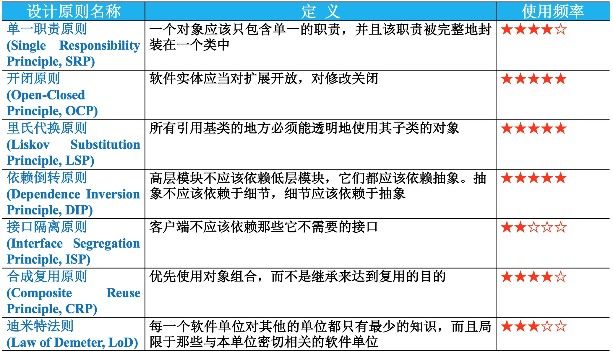

## 2.2 单一职能原则

### 2.2.1、单一职能原则定义

单一职责原则是最简单的面向对象设计原则，用于控制类的粒度大小

> 单一职责原则：一个对象应该只包含单一的职责，并且该职责被完整地封装在一个类中。
Single Responsibility Principle (SRP): Every object should have a single responsibility, and that responsibility should be entirely encapsulated by the class. 

还有另外一种定义的方式：

> 单一职责原则：就一个类而言，应该仅有一个引起它变化的原因
There should never be more than one reason for a class to change.

### 2.2.2、单一职能原则分析

* 一个类（大到模块，小到方法）**承担的职责越多，它被复用的可能性就越小**
* **当一个职责变化时**，可能**会影响其他职责的运作**
* 将这些职责进行分离，**将不同的职责封装在不同的类中**
* **将不同的变化原因封装在不同的类中**
* 单一职责原则是实现**高内聚、低耦合**的指导方针

### 2.2.3、单一职能原则实例

某基于Java的C/S系统的“登录功能”通过如下登录类(Login)实现：
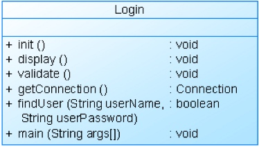

**使用单一职责原则对其进行重构：**
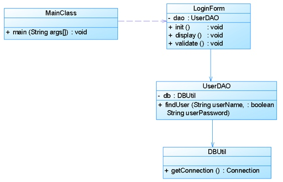

## 2.3、开闭原则

### 2.3.1、开闭原则定义

开闭原则是**面向对象的可复用设计的第一块基石**，是最重要的面向对象设计原则

> 开闭原则：软件实体应当对扩展开放，对修改关闭。
Open-Closed Principle (OCP): Software entities should be open for extension, but closed for modification.

### 2.3.2、开闭原则分析

* 开闭原则由`Bertrand Meyer`于1988年提出
* 在开闭原则的定义中，软件实体可以是**一个软件模块、一个由多个类组成的局部结构或一个独立的类**
* 开闭原则是指软件实体应**尽量在不修改原有代码的情况下进行扩展**
* **抽象化**是开闭原则的关键
* 相对稳**定的抽象层 + 灵活的具体层**
* **对可变性封装原则(Principle of Encapsulation of Variation, EVP)**：找到系统的可变因素并将其封装起来

### 2.3.2、开闭原则实例

某图形界面系统提供了各种不同形状的按钮，客户端代码可针对这些按钮进行编程，用户可能会改变需求要求使用不同的按钮，原始设计方案如图所示：
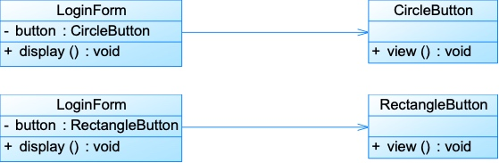

对该系统进行重构，使之满足开闭原则的要求。
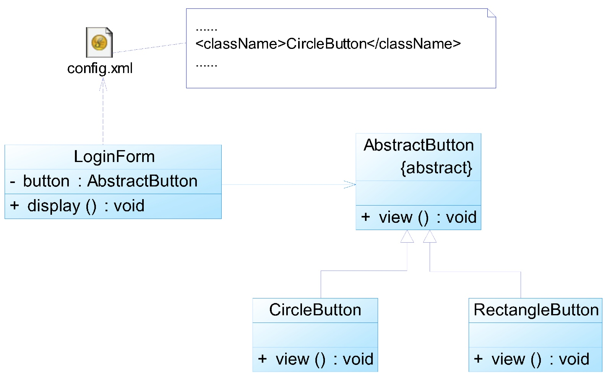

## 2.4、里氏代换原则

### 2.4.1、里氏代换原则定义

> 里氏代换原则：所有引用**基类**的地方必须能透明地使用其**子类**的对象。
Liskov Substitution Principle (LSP): Functions that use pointers or references to **base classes** must be able to use objects of **derived classes** without knowing it.

### 2.4.2、里氏代换原则分析

里氏代换原则由2008年图灵奖得主、美国第一位计算机科学女博士、麻省理工学院教授`Barbara Liskov`和卡内基.梅隆大学`Jeannette Wing`教授于1994年提出

* 在软件中**将一个基类对象替换成它的子类对象，程序将不会产生任何错误和异常**
* 反过来则不一定成立，如果一个软件实体使用的是一个子类对象的话，那么它不一定能够使用基类对象
* 在程序中**尽量使用基类类型来对对象进行定义**，而在运行时再确定其子类类型

### 2.4.3、里氏代换原则实例

某系统需要实现对重要数据（如用户密码）的加密处理，在数据操作类(DataOperator)中需要调用加密类中定义的加密算法，系统提供了两个不同的加密类，CipherA和CipherB，它们实现不同的加密方法，在DataOperator中可以选择其中的一个实现加密操作。如图所示：

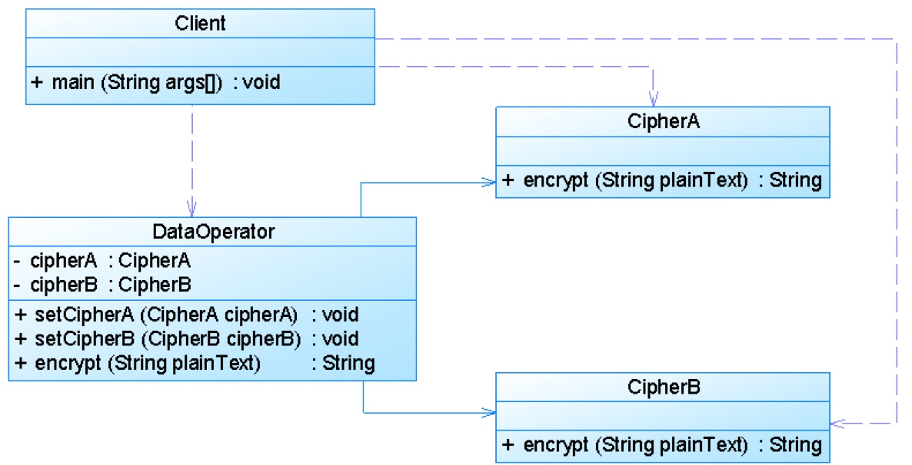

如果需要更换一个加密算法类或者增加并使用一个新的加密算法类，如将CipherA改为CipherB，则需要修改客户类Client和数据操作类DataOperator的源代码，违背了开闭原则。

现使用里氏代换原则对其进行重构，使得系统可以灵活扩展，符合开闭原则。

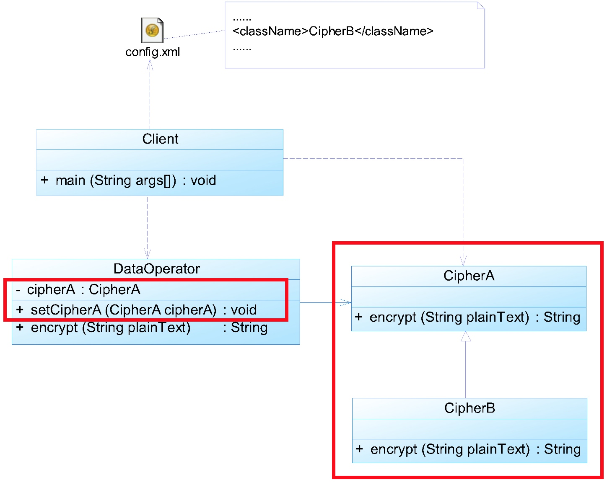

## 2.5、依赖倒转原则
### 2.5.1、依赖倒转原则定义

> 依赖倒转原则：高层模块不应该依赖低层模块，它们都应该依赖抽象。抽象不应该依赖于细节，细节应该依赖于抽象。
Dependency Inversion Principle (DIP): High level modules should not depend upon low level modules, both should depend upon abstractions. Abstractions should not depend upon details, details should depend upon abstractions. 

简单来说，可以这样描述：

> 要针对接口编程，不要针对实现编程
Program to an interface, not an implementation.

### 2.5.2、依赖倒转原则分析

依赖倒转原则是`Robert C. Martin`在1996年为“C++ Reporter”所写的专栏Engineering Notebook的第三篇，后来加入到他在2002年出版的经典著作`《Agile Software Development, Principles, Patterns, and Practices》`一书中

* 在程序代码中传递参数时或在关联关系中，**尽量引用层次高的抽象层类**，即使用接口和抽象类进行变量类型声明、参数类型声明、方法返回类型声明，以及数据类型的转换等
* **在程序中尽量使用抽象层进行编程，而将具体类写在配置文件中**
* 针对抽象层编程，将具体类的对象通过**依赖注入(Dependency Injection, DI)**的方式注入到其他对象
    * 构造注入
    * 设值注入（Setter注入）
    * 接口注入

### 2.5.3、依赖倒转原则实例
某系统提供一个数据转换模块，可以将来自不同数据源的数据转换成多种格式，如，可以转换来自数据库的数据(DatabaseSource)、也可以转换来自文本文件的数据(TextSource)，转换后的格式可以是XML文件(XMLTransformer)、也可以是XLS文件(XLSTransformer)等。

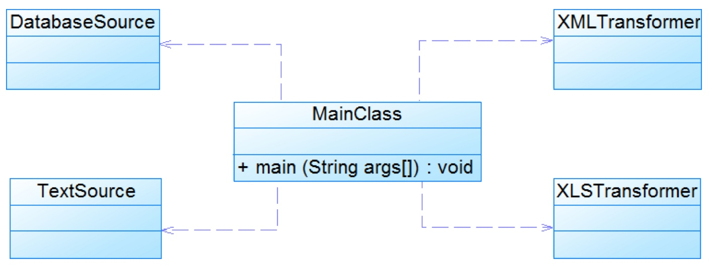

由于需求的变化，该系统可能需要增加新的数据源或者新的文件格式，每增加一个新的类型的数据源或者新的类型的文件格式，客户类MainClass都需要修改源代码，以便使用新的类，但违背了开闭原则。现使用依赖倒转原则对其进行重构。 

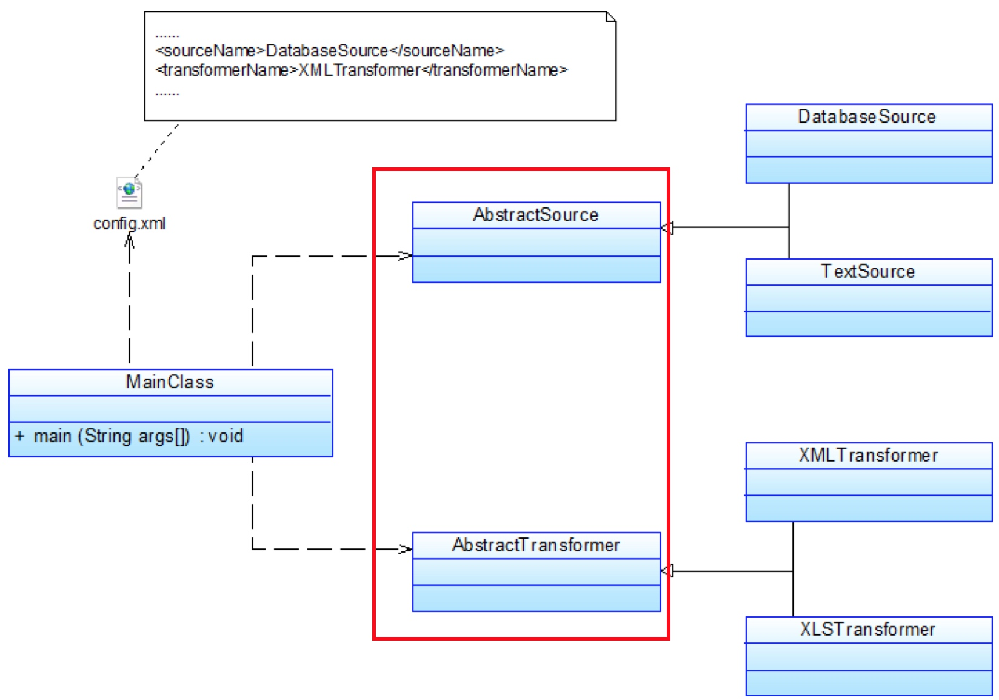

## 2.6、接口隔离原则
### 2.6.1、接口隔离原则定义

> 接口隔离原则：客户端**不应该依赖那些它不需要的接口**。
Interface Segregation Principle (ISP): Clients **should not be forced to depend upon interfaces that they do not use**.

### 2.6.2、接口隔离原则分析
* 当一个接口太大时，需要将它**分割成一些更细小的接口**
* 使用该接口的客户端**仅需知道与之相关的方法即可**
* 每一个接口应该**承担一种相对独立的角色**，不干不该干的事，该干的事都要干

* **“接口”定义(1)：一个类型所提供的所有方法特征的集合**。一个接口代表一个角色，每个角色都有它特定的一个接口，**“角色隔离原则”**
* **“接口”定义(2)：狭义的特定语言的接口**。接口仅仅提供客户端需要的行为，客户端不需要的行为则隐藏起来，应当为客户端提供尽可能小的单独的接口，而不要提供大的总接口，每个接口中只包含一个客户端所需的方法，**“定制服务”**

### 2.6.3、接口隔离原则实例

下图展示了一个拥有多个客户类的系统，在系统中定义了一个巨大的接口（胖接口）AbstractService来服务所有的客户类。

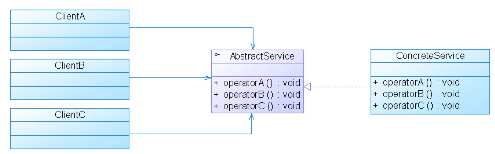

可以使用接口隔离原则对其进行重构。

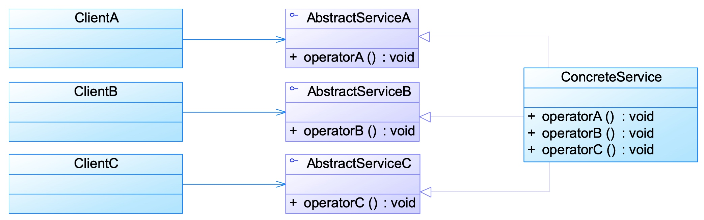

## 2.7、合成复用原则
### 2.7.1、合成复用原则定义

合成复用原则又称为组合/聚合复用原则(Composition/ Aggregate Reuse Principle, CARP)

> 合成复用原则：优先使用对象组合，而不是继承来达到复用的目的。
Composite Reuse Principle (CRP)：Favor composition of objects over inheritance as a reuse mechanism.

### 2.7.2、合成复用原则分析

* 合成复用原则就是在一个新的对象里通过**关联关系（包括组合关系和聚合关系）**来使用一些已有的对象，使之成为新对象的一部分
* 新对象**通过委派调用已有对象的方法**达到复用功能的目的
* 复用时要**尽量使用组合/聚合关系（关联关系），少用继承**

**继承复用：**实现简单，易于扩展。破坏系统的封装性；从基类继承而来的实现是静态的，不可能在运行时发生改变，没有足够的灵活性；只能在有限的环境中使用。**（“白箱”复用 ）**

**组合/聚合复用：**耦合度相对较低，有选择性地调用成员对象的操作；可以在运行时动态进行，新对象可以动态地引用与成员对象类型相同的其他对象。**（“黑箱”复用 ）**

### 2.7.3、合成复用原则实例

某教学管理系统部分数据库访问类设计如图所示：

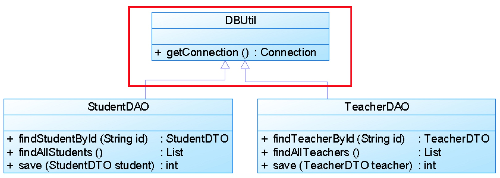

如果需要更换数据库连接方式，如原来采用JDBC连接数据库，现在采用数据库连接池连接，则需要修改DBUtil类源代码。如果StudentDAO采用JDBC连接，但是TeacherDAO采用连接池连接，则需要增加一个新的DBUtil类，并修改StudentDAO或TeacherDAO的源代码，使之继承新的数据库连接类，这将违背开闭原则，系统扩展性较差。

现使用合成复用原则对其进行重构。

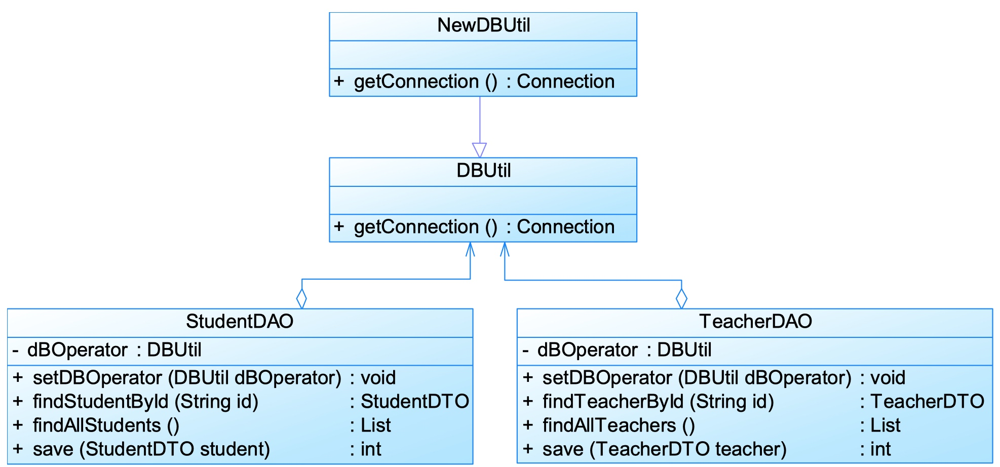

## 2.8、迪米特法则
### 2.8.1、迪米特法则定义
迪米特法则又称为**最少知识原则(Least Knowledge Principle, LKP)**

> 迪米特法则：每一个软件单位对其他的单位都只有最少的知识，而且局限于那些与本单位密切相关的软件单位。
Law of Demeter (LoD): Each unit should have only limited knowledge about other units: only units "closely" related to the current unit.

### 2.8.2、迪米特法则分析

迪米特法则来自于1987年美国东北大学(`Northeastern University`)一个名为“`Demeter`”的研究项目
* 迪米特法则要求**一个软件实体应当尽可能少地与其他实体发生相互作用**
* 应用迪米特法则**可降低系统的耦合度**，使类与类之间保持松散的耦合关系
* 迪米特法则要求在设计系统时，应该尽量**减少对象之间的交互**
* 如果两个对象之间不必彼此直接通信，那么这两个对象就**不应该发生任何直接的相互作用**
* 如果其中一个对象需要调用另一个对象的方法，可以**通过“第三者”转发这个调用**
* 通过**引入一个合理的“第三者”（中间类）来降低现有对象之间的耦合度**

### 2.8.3、迪米特法则案例
某系统界面类(如Form1、Form2等类)与数据访问类(如DAO1、DAO2等类)之间的调用关系较为复杂，如图所示：

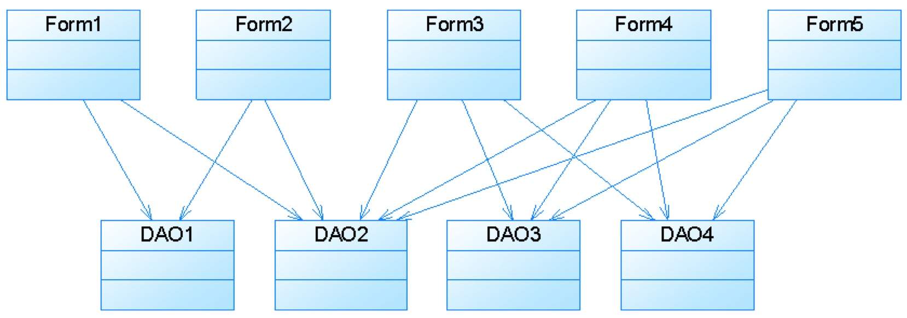

使用迪米特法则重构：

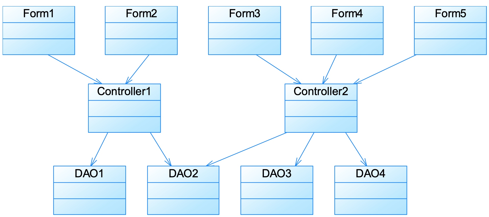

