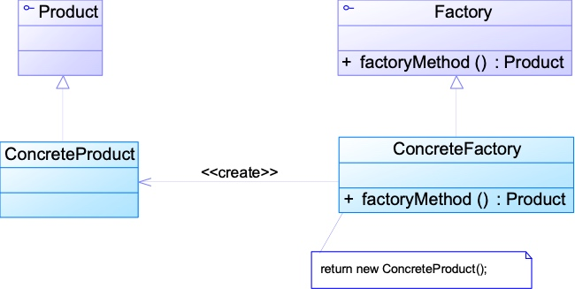
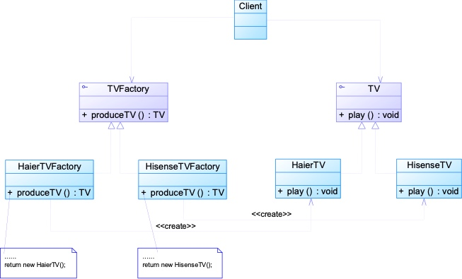

# 四、工厂方法模式

## 4.1、工厂方法模式概述

在简单工厂模式中只提供一个工厂类，该**工厂类处于对产品类进行实例化的中心位置**，它需要知道**每一个产品对象的创建细节**，并**决定何时实例化哪一个产品类**。**简单工厂模式**最大的**缺点是当有新产品要加入到系统中时，必须修改工厂类**，需要在其中加入必要的业务逻辑，这**违背了“开闭原则”**。此外，在简单工厂模式中，所有的产品都由同一个工厂创建，**工厂类职责较重**，**业务逻辑较为复杂**，**具体产品与工厂类之间的耦合度高**，严重影响了系统的灵活性和扩展性，而工厂方法模式则可以很好地解决这一问题。

在工厂方法模式中，我们**不再提供一个统一的工厂类来创建所有的产品对象，而是针对不同的产品提供不同的工厂，系统提供一个与产品等级结构对应的工厂等级结构**。工厂方法模式定义如下：

> **工厂方法模式**(Factory Method Pattern)：定义一个用于创建对象的接口，让子类决定将哪一个类实例化。工厂方法模式让一个类的实例化延迟到其子类。工厂方法模式又简称为工厂模式(Factory Pattern)，又可称作虚拟构造器模式(Virtual Constructor Pattern)或多态工厂模式(Polymorphic Factory Pattern)。工厂方法模式是一种类创建型模式。


## 4.2、模式结构



在工厂方法模式中，**工厂父类负责定义创建产品对象的公共接口**，而**工厂子类则负责生成具体的产品对象**，这样做的目的是**将产品类的实例化操作延迟到工厂子类中完成**，即通过**工厂子类来确定究竟应该实例化哪一个具体产品类**。

## 4.3、模式结构与实现

### 4.3.1、工厂方法模式结构

* **Product（抽象产品）**：它是定义产品的接口，是工厂方法模式所创建对象的超类型，也就是产品对象的公共父类。

* **ConcreteProduct（具体产品）**：它实现了抽象产品接口，某种类型的具体产品由专门的具体工厂创建，具体工厂和具体产品之间一一对应。

* **Factory（抽象工厂）**：在抽象工厂类中，声明了工厂方法(Factory Method)，用于返回一个产品。抽象工厂是工厂方法模式的核心，所有创建对象的工厂类都必须实现该接口。

* **ConcreteFactory（具体工厂）**：它是抽象工厂类的子类，实现了抽象工厂中定义的工厂方法，并可由客户端调用，返回一个具体产品类的实例。

### 4.3.2、工厂方法模式分析

* 工厂方法模式是**简单工厂模式的进一步抽象和推广**

* 工厂方法模式保持了**简单工厂模式的优点，并克服了它的缺点**

* 核心的**工厂类不再负责所有产品的创建**，而是将**具体创建工作交给其子类去完成**

* 可以允许**系统在不修改工厂角色的情况下引进新产品**

* 增加具体产品-->增加具体工厂，**符合“开闭原则”**


### 4.3.3、工厂方法模式实现

与简单工厂模式相比，工厂方法模式最重要的区别是引入了抽象工厂角色，抽象工厂可以是接口，也可以是抽象类或者具体类，其典型代码如下所示：

**抽象工厂接口:**
```java
interface Factory {
    public Product factoryMethod();
}
```

在抽象工厂中声明了工厂方法但并未实现工厂方法，具体产品对象的创建由其子类负责，客户端针对抽象工厂编程，可在运行时再指定具体工厂类，具体工厂类实现了工厂方法，不同的具体工厂可以创建不同的具体产品，其典型代码如下所示：

```java
class ConcreteFactory implements Factory {
    public Product factoryMethod() {
        return new ConcreteProduct();
    }
}
```

在实际使用时，具体工厂类在实现工厂方法时除了创建具体产品对象之外，还可以负责产品对象的初始化工作以及一些资源和环境配置工作，例如连接数据库、创建文件等。

在客户端代码中，只需关心工厂类即可，不同的具体工厂可以创建不同的产品，典型的客户端类代码片段如下所示：

```java
Factory factory;
factory = new ConcreteFactory(); //可通过配置文件和反射实现
Product product;
product = factory.factoryMethod();
```

## 4.4、完整的解决方案示例

```
将原有的电视机工厂进行分割，为每种品牌的电视机提供一个子工厂，
海尔工厂专门负责生产海尔电视机，
海信工厂专门负责生产海信电视机，
如果需要生产TCL电视机或创维电视机，只需要对应增加一个新的TCL工厂或创维工厂即可，
原有的工厂无须做任何修改，使得整个系统具有更加的灵活性和可扩展性。 
```

**参考类图:**



**代码实现:**

**抽象产品接口:TV.java**
```java
package factorymethod;
public interface TV {
    public void display();
}
```

**具体产品类:HaierTV.java**
```java
package factorymethod;

public class HaierTV implements TV {
    @Override
    public void display() {
        System.out.println("海尔电视正在播放中...");
    }
}
```

**具体产品类:HisenseTV.java**
```java
package factorymethod;

public class HisenseTV implements TV {
    @Override
    public void display() {
        System.out.println("海信电视正在播放中...");
    }
}
```

**抽象工厂接口:TVFactory.java**
```java
package factorymethod;

public interface TVFactory {
    public TV produce();
}
```

**具体工厂实现类:HaierTVFactory.java**
```java
package factorymethod;

public class HaierTVFactory implements TVFactory {
    @Override
    public TV produce() {
        TV tv = new HaierTV();
        return tv;
    }
}
```

**具体工厂实现类:HisenseTVFactory.java**
```java
package factorymethod;

public class HisenseTVFactory implements TVFactory {
    @Override
    public TV produce() {
        return new HisenseTV();
    }
}
```

**XML工具类:XMLUtil.java**
```java
package factorymethod;

import org.w3c.dom.Document;
import org.w3c.dom.Node;
import org.w3c.dom.NodeList;

import javax.xml.parsers.DocumentBuilder;
import javax.xml.parsers.DocumentBuilderFactory;
import java.io.File;

public class XMLUtil {
    public static Object getBean(){
        try {
            //创建DOM文档对象
            DocumentBuilderFactory documentBuilderFactory = DocumentBuilderFactory.newInstance();
            DocumentBuilder documentBuilder = documentBuilderFactory.newDocumentBuilder();
            Document doc = documentBuilder.parse(new File("src/FactoryMethodConfig.xml"));
            //获取包含类名的文本节点
            NodeList nodeList = doc.getElementsByTagName("className");
            Node node = nodeList.item(0).getFirstChild();
            String className = node.getNodeValue().trim();
            //通过反射，将读取出来的类名字符串转换为对象
            Class<?> aClass = Class.forName(className);
            Object o = aClass.newInstance();
            return o;
        } catch (Exception e) {
            e.printStackTrace();
            return null;
        }

    }
}
```

**测试类:**
```java
package factorymethod;

public class Test {
    public static void main(String[] args) {
        /*TVFactory tvFactory = new HaierTVFactory();
        TV tv = tvFactory.produce();
        tv.display();*/

        //通过配置文件获取
        TVFactory tvFactory = (TVFactory) XMLUtil.getBean();
        TV tv = tvFactory.produce();
        tv.display();
    }
}
```

## 4.5、工厂方法模式总结

工厂方法模式是简单工厂模式的延伸，它继承了简单工厂模式的优点，同时还弥补了简单工厂模式的不足。工厂方法模式是使用频率最高的设计模式之一，是很多开源框架和API类库的核心模式。

### 4.5.1、主要优点

工厂方法模式的主要优点如下：

1. 在工厂方法模式中，工厂方法用来创建客户所需要的产品，同时还向客户隐藏了哪种具体产品类将被实例化这一细节，用户只需要关心所需产品对应的工厂，无须关心创建细节，甚至无须知道具体产品类的类名。

2. 基于工厂角色和产品角色的多态性设计是工厂方法模式的关键。它能够让工厂可以自主确定创建何种产品对象，而如何创建这个对象的细节则完全封装在具体工厂内部。工厂方法模式之所以又被称为多态工厂模式，就正是因为所有的具体工厂类都具有同一抽象父类。

3. 使用工厂方法模式的另一个优点是在系统中加入新产品时，无须修改抽象工厂和抽象产品提供的接口，无须修改客户端，也无须修改其他的具体工厂和具体产品，而只要添加一个具体工厂和具体产品就可以了，这样，系统的可扩展性也就变得非常好，完全符合“开闭原则”。

 

### 4.5.2、主要缺点

工厂方法模式的主要缺点如下：

1. 在添加新产品时，需要编写新的具体产品类，而且还要提供与之对应的具体工厂类，系统中类的个数将成对增加，在一定程度上增加了系统的复杂度，有更多的类需要编译和运行，会给系统带来一些额外的开销。

2. 由于考虑到系统的可扩展性，需要引入抽象层，在客户端代码中均使用抽象层进行定义，增加了系统的抽象性和理解难度，且在实现时可能需要用到DOM、反射等技术，增加了系统的实现难度。 

### 4.5.3、适用场景

在以下情况下可以考虑使用工厂方法模式：

* **客户端不知道它所需要的对象的类**。在工厂方法模式中，客户端不需要知道具体产品类的类名，只需要知道所对应的工厂即可，具体的产品对象由具体工厂类创建，可将具体工厂类的类名存储在配置文件或数据库中。

* **抽象工厂类通过其子类来指定创建哪个对象**。在工厂方法模式中，对于抽象工厂类只需要提供一个创建产品的接口，而由其子类来确定具体要创建的对象，利用面向对象的多态性和里氏代换原则，在程序运行时，子类对象将覆盖父类对象，从而使得系统更容易扩展。

