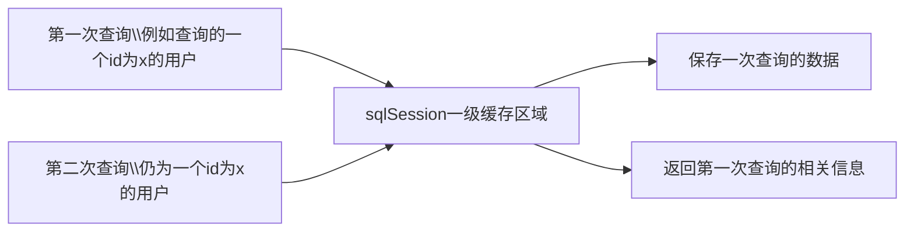
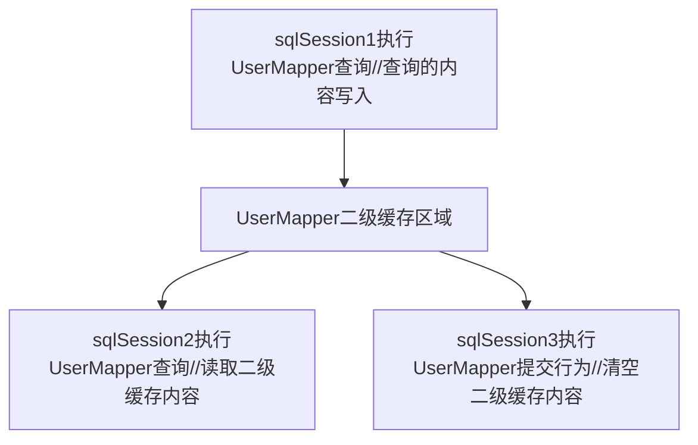

## 关于查询缓存

对于查询来说，缓存是用于减少查询压力的，将第一次查询到的数据放入内存以便下一次查询时能直接从内存中调取，减少与服务器通讯的次数，提升数据库的性能

对于mybatis来说，其将查询缓存分为了一级缓存与二级缓存

### 一级缓存（默认开启

一级缓存是sqlSession级别的缓存，在此对象中有一个HashMap用于缓存数据，而不同的sqlSession之间的缓存数据区域是不影响的

一级缓存的作用就在于：

在执行同一个sqlSession之后，第一次执行完毕所获得的数据会被保存在缓存内部，第二次读取会从缓存中获取相应的数据，减少与数据库通信，而当这个sqlSession结束之后，此sqlSession的缓存会被刷新，它所包含的相关数据也会被刷新

例如：

### 二级缓存

二级缓存与一级缓存最明显的区别在于：他们访问的范围不一样，二级缓存的范围更大了，多个sqlSession是可以共享一个userMapper下的二级缓存的，并且数据的类型仍然与sqlSession一级缓存一致 (HashMap)

